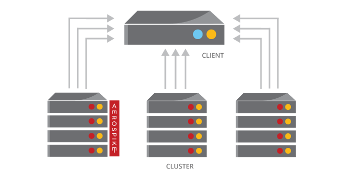

# Aerospike Batch Processing

## Problem
You want to process all of the records, perhaps billions of records, in an Aerospike database. You don't have heap space in you application to process them all at once, so you would like to "batch  process" them, 1,000 at a time.  

## Solution
Use the Aerospike `scanAll()` method to scan the entire namespace, or namespace and set. Each record is retrieved from a buffered queue one at a time. You can collect the returned records into a "batch", and then process the batch of records.

The source code for this solution is available on GitHub, and the README.md 
https://github.com/helipilot50/aerospike-batch-processing.git. 

This is a Java example, but the same principles can be applied to any programming language supported by Aerospike.

### How to build
Clone the GitHub repository with:
```bash
git clone https://github.com/helipilot50/aerospike-batch-processing.git
```

The build uses Maven, to build the solution use:
```bash
mvn clean package
```
This will produce a complete jar `aerospike-batch-processing-1.0.0-full.jar` in the `target` directory.

### How to run
The jar `aerospike-batch-processing-1.0.0-full.jar` is runnable with the following options
```
options:
-g,--gen              Generate data
-h,--host <arg>       Server hostname (default: 127.0.0.1)
-n,--namespace <arg>  Namespace (default: test)
-p,--port <arg>       Server port (default: 3000)
-s,--set <arg>        Set (default: demo)
-u,--usage            Print usage.
```
To generate some test data use the `-g` option
```bash
java -jar aerospike-batch-processing-1.0.0-full.jar -g
```
This will generate 99,999 user records.

To run the batch processing, uses the same command without any options
```bash
java -jar aerospike-batch-processing-1.0.0-full.jar
```

## Discussion


So how does it work? 

A scan operation is sent from the Aerospike client to each node in the cluster. Each node responds with a stream of records. IN the client, the records a put into a buffered queue, and the protocol will fill the buffer until it is full, then wait until records are are `read` from the queue by callback in your application.

This way you application does not run out of heap space. 



Look at the `batchUsingScanAll()` method. It uses the `scanAll()`  method on the Aerospike client, and you supply a user written callback to process each record as it is received from the cluster.
```java
	public void batchUsingScanAll() throws Exception {
		/*
		 * a List to contain a "batch" of records to process
		 */
		final List<Record> batchOfRecords = new ArrayList<Record>();
		/*
		 * Scan all "namespace" and "set to retrieve each record
		 */
		this.client.scanAll(null, this.namespace, this.set, 
				new ScanCallback() {

			@Override
			public void scanCallback(Key key, Record record) 
					throws AerospikeException {
				/*
				 * process each Record into a "batch" 
				 */
				if (batchOfRecords.size() == BATCH_SIZE){
					for (Record rec : batchOfRecords){
						/*
						 * do something with each record in the batch 
						 */
						System.out.print("+");
					}
					System.out.println();
					System.out.println("Processed " + BATCH_SIZE + " records");
					batchOfRecords.clear();
				}
				batchOfRecords.add(record);
			}
		}, "username","password","gender","region",
			"lasttweeted","tweetcount","interests");
	}

```

The call back receives a `Record` and a `Key` and you can process these in any way you wish. This code builds a batch of records in a `List`. When the batch is full, we `process` the batch. 

